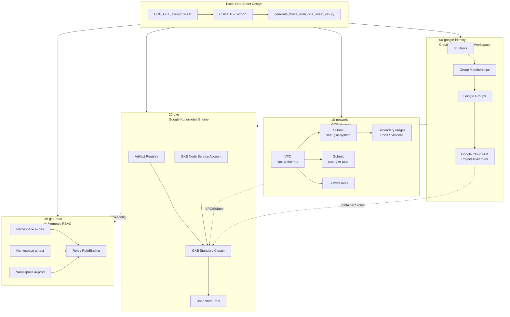

# GCP GKE Small Company Lab

Azure `Entra ID + AKS` 실습 레포를 GCP 전용 구조로 변환한 Terraform 예제입니다.  
레포명은 요청에 맞춰 `GCP-GKS-small_company`로 두었지만, GCP의 Kubernetes 관리형 서비스 정식 명칭은 **GKE, Google Kubernetes Engine**입니다.

## 1. 목적

이 레포는 작은 회사 기준의 GCP/GKE 실습 환경을 단계별로 구성합니다.

- Google Workspace / Cloud Identity 사용자와 그룹 설계
- Google Cloud IAM 그룹 기반 권한 모델
- GKE용 VPC, Subnet, Pod/Service secondary range 구성
- GKE Standard Cluster, Node Pool, Artifact Registry 구성
- Kubernetes Namespace, Role, RoleBinding 구성
- Excel 1장 기반 설계값을 CSV/tfvars로 변환하여 Terraform 적용

핵심 원칙은 다음입니다.

```text
Users -> Google Groups -> Google Cloud IAM -> GKE Cluster Access -> Kubernetes RBAC
```

사용자에게 직접 권한을 부여하지 않고, 그룹에 권한을 부여한 뒤 사용자를 그룹에 배치하는 구조입니다.

## 2. 전체 구성도



## 3. Azure에서 GCP로 변환한 대응표

| Azure 원본 | GCP 변환 |
|---|---|
| Microsoft Entra ID User | Google Workspace / Cloud Identity User |
| Entra ID Security Group | Google Group |
| Azure RBAC | Google Cloud IAM |
| Azure VNet | GCP VPC Network |
| Azure Subnet | GCP Subnetwork |
| NSG | VPC Firewall Rule |
| AKS | GKE Standard Cluster |
| ACR | Artifact Registry Docker Repository |
| AKS Azure RBAC | Google Cloud IAM + GKE/Kubernetes RBAC |
| Kubernetes Namespace/RoleBinding | 동일하게 Kubernetes Provider 사용 |

## 4. 디렉터리 구조

```text
GCP-GKS-small_company/
├── 00-google-identity/
│   └── Google Workspace / Cloud Identity / IAM
├── 10-network/
│   └── VPC / Subnet / Firewall
├── 20-gke/
│   └── GKE / Node Pool / Artifact Registry
├── 30-gke-rbac/
│   └── Namespace / Role / RoleBinding
├── design/
│   └── ONE_SHEET_EXCEL_GUIDE.md
├── scripts/
│   └── generate_tfvars_from_one_sheet_csv.py
├── CONVERSION_MAP.md
└── README.md
```

## 5. Excel 1장 설계 적용 흐름

Excel 파일의 `GCP_GKE_Design` 한 시트에 모든 속성을 넣습니다.

주요 컬럼:

| Column | Purpose |
|---|---|
| `Section` | 적용 단계 |
| `Resource Type` | 리소스 유형 |
| `Enabled` | 적용 여부 |
| `Apply Order` | 적용 순서 |
| `Resource Key` | 리소스 고유 키 |
| `Depends On` | 선행 리소스 |
| `Project ID` | GCP 프로젝트 ID |
| `Region` | GCP Region |
| `Generated File` | 생성 대상 tfvars/csv |

사용 절차:

```bash
# 1. Excel 수정 후 CSV UTF-8로 저장
# 예: gcp_gke_small_company_one_sheet_design.csv

# 2. CSV에서 tfvars 생성
python3 scripts/generate_tfvars_from_one_sheet_csv.py \
  --input gcp_gke_small_company_one_sheet_design.csv \
  --out-dir _generated

# 3. 생성된 tfvars를 각 Terraform stack에 복사
cp _generated/10-network/sonmap.auto.tfvars 10-network/sonmap.auto.tfvars
cp _generated/20-gke/sonmap.auto.tfvars 20-gke/sonmap.auto.tfvars
cp _generated/30-gke-rbac/sonmap.auto.tfvars 30-gke-rbac/sonmap.auto.tfvars
```

자세한 설명은 `design/ONE_SHEET_EXCEL_GUIDE.md`를 확인하세요.

## 6. 배포 순서

```bash
cd 00-google-identity
terraform init
terraform plan
terraform apply

cd ../10-network
terraform init
terraform plan
terraform apply

cd ../20-gke
terraform init
terraform plan
terraform apply

cd ../30-gke-rbac
terraform init
terraform plan
terraform apply
```

## 7. 사전 준비

```bash
gcloud auth login
gcloud config set project <PROJECT_ID>
gcloud services enable \
  compute.googleapis.com \
  container.googleapis.com \
  artifactregistry.googleapis.com \
  cloudresourcemanager.googleapis.com \
  iam.googleapis.com
```

Google Workspace / Cloud Identity 그룹을 Terraform으로 관리하려면 Google Workspace Admin SDK 권한과 적절한 위임 설정이 필요합니다. 일반 GCP 프로젝트 IAM만 테스트하려면 `00-google-identity` 단계는 CSV 설계/수동 그룹 생성으로 대체할 수 있습니다.

## 8. 운영 보강 항목

- Terraform remote backend: GCS bucket 사용
- GKE private cluster 검토
- Cloud NAT / Private Google Access 검토
- Workload Identity Federation 적용
- Organization Policy, IAM Recommender, SCC 점검
- Cloud Logging / Monitoring / Alerting 연동
- 비용 예산 Budget Alert 설정
